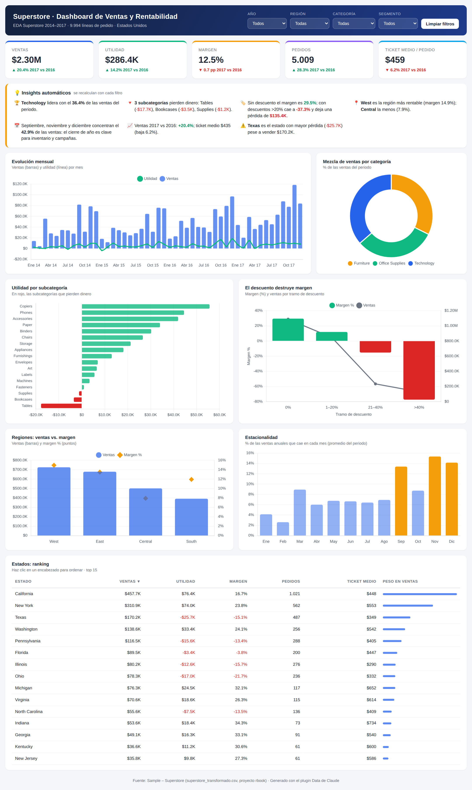

# Superstore · Dashboard interactivo (HTML)

Dashboard web interactivo sobre el dataset **Sample – Superstore** (2014–2017, 9.994 líneas de pedido). Es la continuación visual del EDA [rbook](https://github.com/AlexT09/rbook): responde a la pregunta *¿qué factores explican el nivel de ventas y la rentabilidad?* con filtros, KPIs, insights automáticos y seis gráficos.



## Qué incluye

| Bloque | Detalle |
|---|---|
| **Filtros** | Año, región, categoría y segmento. Todo el tablero se recalcula al instante. |
| **KPIs** | Ventas, utilidad, margen, pedidos únicos y ticket medio, con variación frente al año anterior. |
| **Insights automáticos** | Siete frases que se reescriben con cada filtro: categoría líder, subcategorías con pérdidas, efecto del descuento, región más y menos rentable, estacionalidad, crecimiento anual y estado con mayor pérdida. |
| **Gráficos** | Evolución mensual (ventas y utilidad), mezcla por categoría, utilidad por subcategoría, margen por tramo de descuento, ventas vs. margen por región y estacionalidad. |
| **Tabla** | Ranking de estados, ordenable por cualquier columna. |

## Hallazgos principales (sin filtros)

- **Technology** es la categoría que más vende (36,4 % de las ventas).
- **El descuento destruye margen**: sin descuento el margen es 29,5 %. Con descuentos mayores al 20 % cae a −37,3 % y deja una pérdida de 135 mil USD.
- **Tables, Bookcases y Supplies** son las únicas subcategorías con utilidad negativa.
- **West** es la región más rentable (14,9 % de margen) y **Central** la menos rentable (7,9 %).
- **Septiembre, noviembre y diciembre** concentran el 42,9 % de las ventas.
- Las ventas de 2017 crecieron **+20,4 %** frente a 2016, aunque el ticket medio bajó 6,2 %.
- **Texas** vende 170 mil USD y aun así es el estado con mayor pérdida (−25,7 mil USD).

## Estructura

```
├── data/superstore_transformado.csv   # dataset limpio (salida del ETL de rbook)
├── src/template.html                  # plantilla del dashboard (HTML + CSS + JS)
├── src/chart.umd.js                   # Chart.js 4.4.4, se incrusta en el HTML final
├── scripts/build_dashboard.py         # genera el sitio a partir del CSV
├── docs/_build/html/index.html        # dashboard final autocontenido (lo que publica GitHub Pages)
├── assets/dashboard_screenshot.png    # captura para este README
└── publish.sh                         # inicializa el repo y publica en GitHub Pages
```

El `index.html` es **autocontenido**: los datos y Chart.js van incrustados, así que funciona sin conexión con solo abrirlo en el navegador.

## Regenerar el dashboard

```bash
pip install -r requirements.txt
python scripts/build_dashboard.py      # reescribe docs/_build/html/index.html
```

Para usar otros datos, reemplaza `data/superstore_transformado.csv` por un archivo con las mismas columnas y vuelve a ejecutar el script.

## Publicar en GitHub Pages

```bash
git init
git remote add origin https://github.com/AlexT09/superstore-dashboard-html.git
git checkout -b main
git add -A && git commit -m "Dashboard Superstore" && git push -u origin main
ghp-import -n -p -f docs/_build/html
```

Configura GitHub Pages una sola vez en **Settings → Pages**:

- **Source:** Deploy from a branch
- **Branch:** `gh-pages` → `/ (root)`

Si prefieres no hacerlo a mano, `./publish.sh` ejecuta todos estos pasos. Si tienes la CLI `gh` instalada, además crea el repositorio privado.

> **Nota:** GitHub Pages en repositorios **privados** requiere GitHub Pro, Team o Enterprise. Con una cuenta gratuita, el repositorio debe ser público para que se publique la página.

---
Autores del EDA: Alex Teran y David Estrada.
